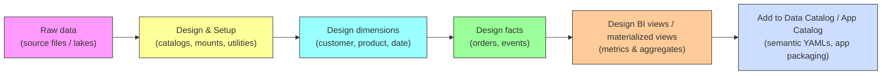

# FMCG Databricks pipeline

## Purpose

This is a Databricks-first ETL & semantic pipeline for FMCG analytics: notebooks to create catalogs, build dimension and fact data-processing pipelines, create semantic/metric views, and an example app packaged under an app catalog.

## Overview
<!-- Process flow visual for quick orientation -->

## Folder map

- databricks.yml — repo-level profile/metadata (likely used by Databricks deployment tooling).
- README.md, LICENSE — project docs & license.
- src/ — main code and notebooks:
- fmcg_eda.ipynb — exploratory analysis notebook.

### 1_setup/

- dim_date_table_creation.ipynb — create date dimension / calendar.
- setup_catalogs.ipynb — configure Unity Catalog / catalogs / schemas or mounts.
- utilities.ipynb — helper functions (UDFs, common utilities)

### 2_dim/ — dimension processing notebooks (customer, products, pricing)

- 1_customer_data_processing.ipynb
- 2_products_data_processing.ipynb
- 3_pricing_data_processing.ipynb

### 3_fact_data_processing/

- 1_full_load_fact.ipynb
- 2_incremental_load_fact.ipynb — full & incremental ETL for fact tables.

### 4_semantic/

- 4_fmcg_mv.dbquery.ipynb
- 5_refresh_fmcg_mv.dbquery.ipynb — build and refresh materialized/metric views
- 6_create_metric_view.ipynb
dim_customers_metrics.yaml, fact_orders_enriched_metrics.yaml — metric/view definitions (YAML for semantic layer).

### 5_app_catalog/

- app-data-catalog-fmcg/ — a small example application (Flask/Streamlit-like) with app.py, app.yaml, requirements.txt — runnable demo app
